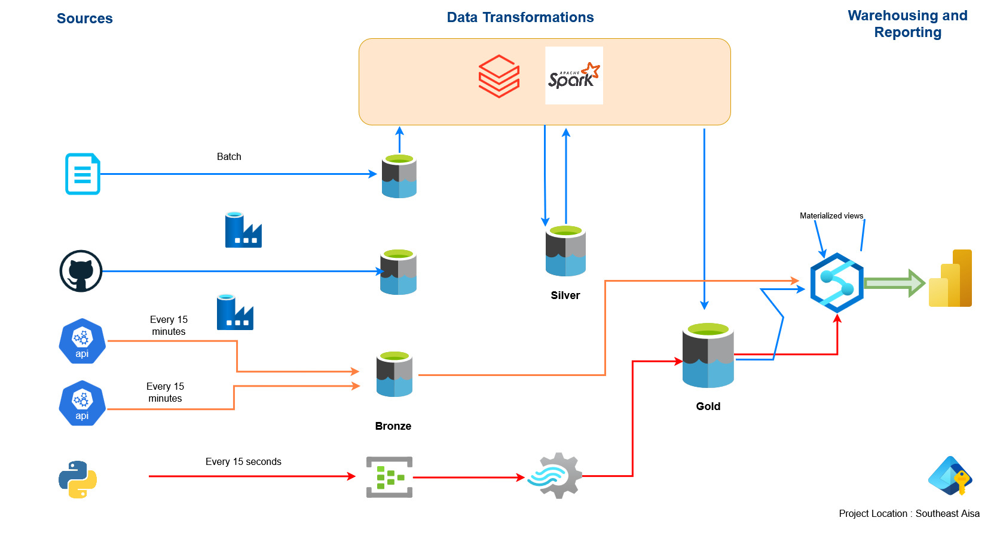
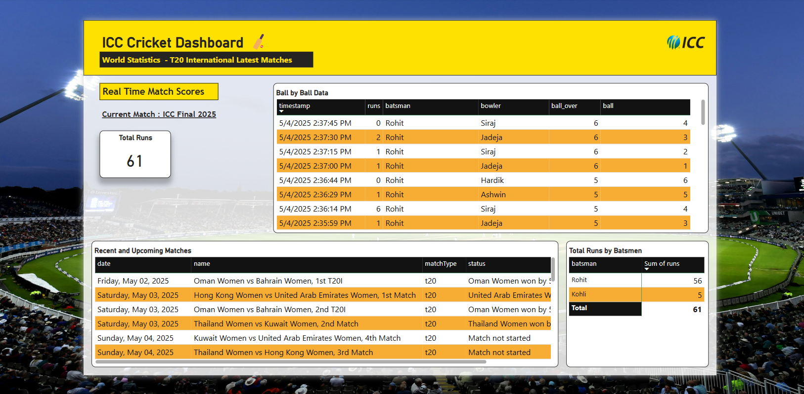
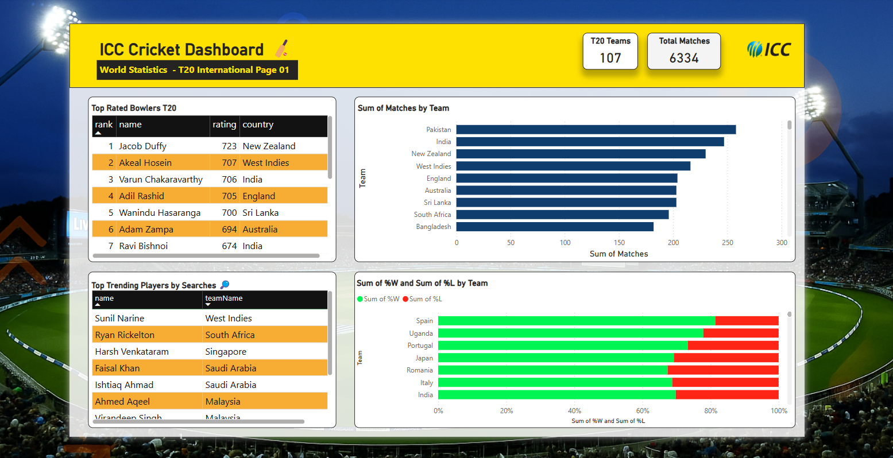
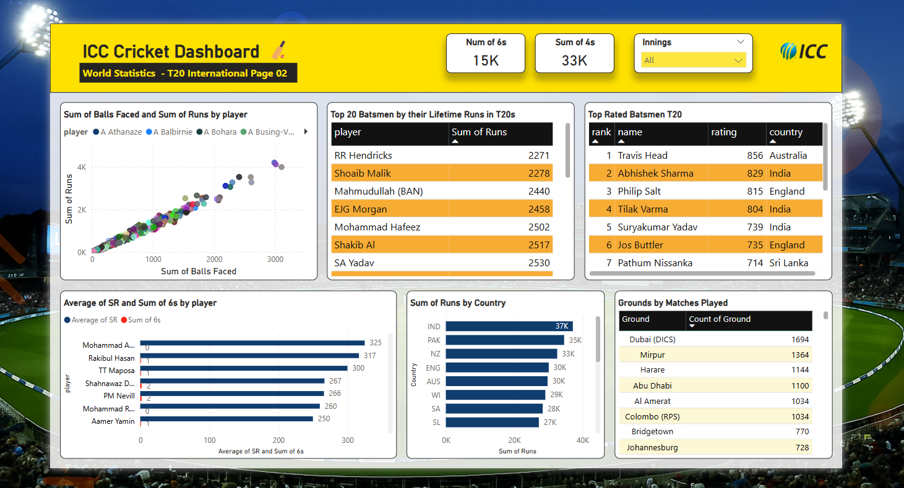
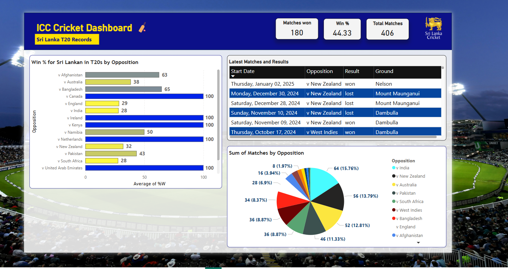

# ICC T20 Cricket Big Data Engineering Solution 🏏 | Azure

End to End Big Data Solution using the Lambda Architecture.

This solution is capable of processing both historical and batch data sources by incorporating historical datasets, Near-real-time data with APIs from Crickbuzz and Cricketdata.org and streaming data pushed to event hub that's updated every 15 seconds to simulate ball by ball data in a scenario of a match. 

This robust scalable solution leverages production ready tooling on Azure to deliver accurate insights onto T20 Cricket Data and provides and interactive dashboard with 4 reports detailing multiple levels of the game. 

Demo and Full Project Walkthrough Video 🔗  

**Tech Stack Used:**

## Architecture Diagram

## Dashboard Reports in Power BI

Realtime Report  

ICC T20 Overview Report

ICC T20 Batting Report

Sri Lanka Cricket in ICC T20

---
Built with ❤️ by [Subhanu](https://github.com/subhanu-dev)
